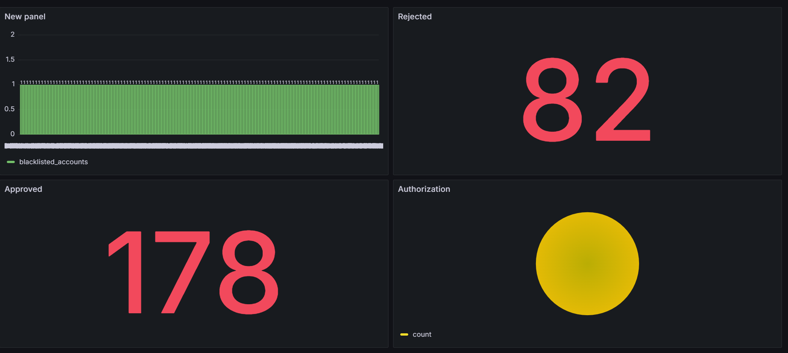

# 🧭 Banking Analytics Dashboard (Grafana + PostgreSQL + Synthetic Data)

> 🚀 A containerized, production-style demo that continuously generates synthetic card-transaction data, writes to PostgreSQL (local or AWS RDS), and visualizes key metrics in Grafana via auto-provisioned datasource and dashboard.

---


---

## ✅ Features

* **End-to-end stack**: Synthetic data generator ➜ PostgreSQL ➜ Grafana dashboards
* **Auto-provisioned Grafana**: Datasource + dashboard loaded at container start
* **RDS or local PostgreSQL**: SSL (`require`) for RDS, or disable SSL for local dev
* **Config via `.env`**: Works with `PG_*` and `DB_*` prefixes (generator supports both)
* **Resilient startup**: Creates schema if missing, batched inserts with `execute_batch`
* **Composable**: Everything runs with `docker compose up`

---

## 📸 Dashboard Screenshot

> View of the provisioned Grafana dashboard wired to PostgreSQL



---

## 📂 Project Structure

```text
grafana-dashboard-app/
├── data_generator/
│   ├── app/
│   │   ├── __init__.py
│   │   ├── config.py          # Loads env, supports DB_* or PG_*; batching/interval config
│   │   ├── db.py              # Connect, ensure schema, batched inserts
│   │   ├── generator.py       # Faker-based transaction records
│   │   ├── logging.py         # Central logging config
│   │   ├── main.py            # Service loop: generate → insert
│   │   └── rules.py           # Simple business rules → decision + explanations
│   └── Dockerfile             # Slim Python image; copies app + sql
├── grafana/
│   ├── dashboards/
│   │   ├── banking_dashboard.json
│   │   └── provider.yaml      # Dashboard provisioning
│   └── datasources/
│       └── postgres.yaml      # Datasource provisioning (points to your PG/RDS)
├── sql/
│   ├── schema.sql             # Table + indexes
│   └── insert.sql             # Insert statement
├── docker-compose.yml         # Grafana + data_generator services
├── .env                       # Your secrets and connection info (do NOT commit)
└── requirements.txt
```

---

## 🔁 Data Flow

```text
Synthetic Generator (Faker + rules)
            │  batched rows
            ▼
       PostgreSQL (local or RDS)
            │  SQL queries
            ▼
         Grafana (provisioned datasource + dashboard)
```

---

## ⚙️ Configuration

Create and fill a **`.env`** file in the repo root:

```dotenv
# --- PostgreSQL (RDS or local) ---
PG_HOST=banking-db.xxxxxx.us-east-1.rds.amazonaws.com   # or host.docker.internal for local PG
PG_PORT=5432
PG_DB=postgres
PG_USER=postgres
PG_PASSWORD=your_password
PG_SSLMODE=require                   # RDS: require | Local: disable

# --- Generator tuning ---
BATCH_SIZE=10                        # rows per cycle
SLEEP_SECONDS=15                     # seconds between batches

# --- Optional logging ---
LOG_LEVEL=INFO
```

> The generator also accepts `DB_*` (DB\_HOST/DB\_NAME/…) if you prefer that prefix.
> Grafana provisioning uses the `PG_*` variables.

---

## 🚀 Run

### 1) With Docker Compose

```bash
docker compose up --build -d
# follow generator logs
docker compose logs -f data_generator
```

Open Grafana at **[http://localhost:3000](http://localhost:3000)**.
This setup enables **anonymous Viewer** access for local demo.

### 2) Using a local PostgreSQL instead of RDS

* Set `PG_HOST=host.docker.internal`
* Set `PG_SSLMODE=disable`
* Ensure your local PostgreSQL is listening on 5432 and accessible.

---

## 📊 Grafana Setup & Usage

Grafana is fully **provisioned** from files to avoid manual clicks:

* **Datasource**: `grafana/datasources/postgres.yaml`

  * Uses environment variables from `.env`
  * Stable **UID**: `pg-rds` (used by the dashboard JSON)
* **Dashboard**: `grafana/dashboards/banking_dashboard.json`

  * Panels already wired to the `pg-rds` datasource
* **Provider**: `grafana/dashboards/provider.yaml`

### Access

* URL: `http://localhost:3000`
* Anonymous **Viewer** is enabled for convenience. Disable for real deployments.

### Customize

* Edit panels in the UI → **Save dashboard** → **Export** (or overwrite the JSON file)
* Change datasource name/UID? Update the dashboard JSON to match the new UID.

### (Optional) API Key & CI

* Create an API key (Server Admin → **API Keys**) to import dashboards programmatically.
* Use it with Grafana HTTP API for automation in CI/CD.

---

## 📊 Dashboard Panels (Default)

* **Rejected** – `SELECT COUNT(*) FROM banking_data WHERE decision = 'Rejected'`
* **Approved** – `SELECT COUNT(*) FROM banking_data WHERE decision = 'Approved'`
* **Blacklisted account transactions (bar)** – per `account_id` where `account_blacklisted = true`
* **Authorization split (pie)** – `SELECT trans_type, COUNT(*) FROM banking_data GROUP BY trans_type`

> All panels are pre-wired to the provisioned Postgres datasource.

---

## 🧱 Database Schema (excerpt)

```sql
CREATE TABLE IF NOT EXISTS banking_data (
    id SERIAL PRIMARY KEY,
    timestamp TIMESTAMPTZ NOT NULL,
    uniq_id UUID NOT NULL,
    trans_type VARCHAR(50) NOT NULL,
    amount DECIMAL(10, 2) NOT NULL,
    amount_crr DECIMAL(10, 2) NOT NULL,
    account_holder_name VARCHAR(100) NOT NULL,
    card_presense VARCHAR(50) NOT NULL,
    merchant_category VARCHAR(50) NOT NULL,
    card_type VARCHAR(50) NOT NULL,
    card_id VARCHAR(20) NOT NULL,
    account_id UUID NOT NULL,
    account_blacklisted BOOLEAN NOT NULL,
    rules_triggered VARCHAR(100),
    rules_explanation VARCHAR(100),
    decision VARCHAR(100)
);
```

Indexes on `timestamp`, `(decision, timestamp)`, `(merchant_category, timestamp)`, and `(account_blacklisted, timestamp)` are included for faster queries.

---

## 🔬 Verifying Data

From psql / any SQL client:

```sql
SELECT COUNT(*) FROM banking_data;
SELECT decision, COUNT(*) FROM banking_data GROUP BY decision;
SELECT * FROM banking_data ORDER BY timestamp DESC LIMIT 5;
```

In container logs you should see:

```
Ensuring database schema...
Schema ready.
Inserted N rows.
```

---

## 🛠️ Customization

* **Rules**: tweak thresholds/logic in `data_generator/app/rules.py`
* **Categories/card types**: edit `MERCHANT_CATEGORIES` / `CARD_TYPES` in `generator.py`
* **Insert frequency/size**: adjust `BATCH_SIZE` and `SLEEP_SECONDS` in `.env`
* **Dashboard**: modify `grafana/dashboards/banking_dashboard.json` (or edit in UI and export)

---

## 🧰 Troubleshooting

**Panels show “No data”**

* Check generator logs: `docker compose logs -f data_generator`
* Verify DB connectivity/creds in `.env`
* For **AWS RDS**:

  * Allow your Docker host IP in the RDS **Security Group** (port 5432)
  * Keep `PG_SSLMODE=require`
* For **local PG**:

  * Use `PG_HOST=host.docker.internal` and `PG_SSLMODE=disable`
* Ensure the table exists: `SELECT to_regclass('public.banking_data');`

**SQL file not found**

* We copy `/sql` into the image; `db.py` resolves `/app/sql/*.sql`. Rebuild:

  ```bash
  docker compose build --no-cache && docker compose up -d
  ```

**Grafana datasource mismatch**

* Datasource is provisioned from `grafana/datasources/postgres.yaml`.
  If you change its `name/uid`, also update the dashboard JSON or re-link panels in the UI.

**Auth/Login**

* Anonymous Viewer is enabled for local demos. Disable it for real deployments by removing:

  * `GF_AUTH_ANONYMOUS_ENABLED=true`
  * `GF_AUTH_DISABLE_LOGIN_FORM=true`
    and create a proper admin user/API key.

---

## 🔐 Security Notes

* **Never commit `.env`** with real credentials.
* For production, restrict RDS ingress, rotate DB passwords, and disable anonymous Grafana access.
* Consider provisioning Grafana via API with **short-lived** tokens and enabling TLS.

---

## 🧹 Cleanup

```bash
docker compose down
```

---

## 📄 License

Add a license of your choice (e.g., MIT) in `LICENSE`.

---

## 👨‍💻 Author

**Gokul Krishna N V**
Machine Learning Engineer — UK 🇬🇧
[GitHub](https://github.com/megokul) • [LinkedIn](https://www.linkedin.com/in/nv-gokul-krishna)

---

### What you get out of the box

* Synthetic data stream with clear, editable rules
* One-click Grafana provisioning wired to your database
* A minimal, readable codebase designed for extension

> Tip: Add a panel showing `max(timestamp)` from `banking_data` to confirm “freshness” at a glance.
